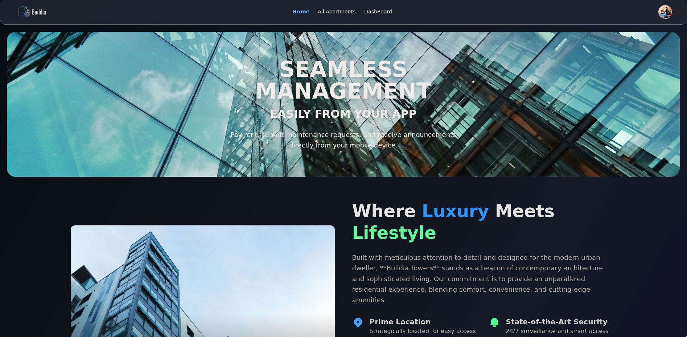
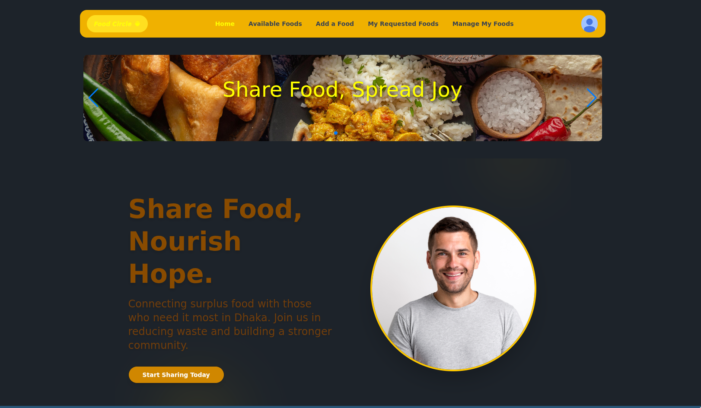
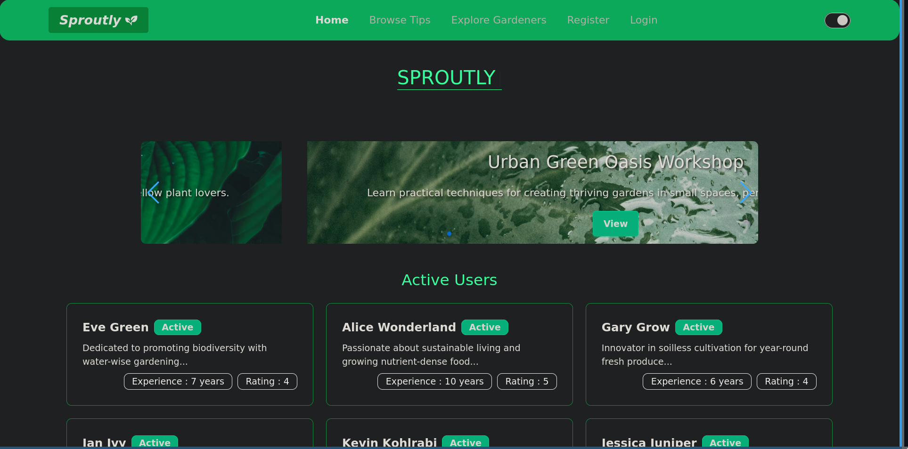

<div align="center">
  
</div>

<!-- SOCIAL LINKS -->
<div align="center">
  <a href="https://www.linkedin.com/in/zane-pearton">
    
  </a>
  <a href="https://linktr.ee/zanepearton">
    
  </a>
  <a href="https://dev.to/zanepearton">
    
  </a>
  <a href="https://github.com/ZanePearton/ZanePearton">
    
  </a>
  
</div>

---

## 🚀 About Me

<div align="center">
  
</div>

> **Building the future at the intersection of front-end and back-end technologies**

Software Engineer with **Bangladeshi/BD citizenship**, I’m a Full-Stack Developer who loves bringing ideas to life! ✨ I spend my days building dynamic web apps with React, and on the backend, I’m rocking Node.js, Express, and MongoDB. My favorite projects are the ones that let me tackle a new challenge, from secure authentication to seamless database management. Let's build something great together! 🚀.

**Current Focus:** Exploring Nextjs, Web-Sockets, and three-js.

---

## 🛠️ Technical Toolkit

<div align="center">
  
### Core Specializations
                  
</div>

---

---

## 🌟 Featured Projects

### 🏢 Websites

<table width="100%">
<tr>
<td width="50%" align="center">

#### 🏠 **Buildia-A home rental platform**

[]

Buildia is a modern, full-stack web application designed to streamline apartment management, from showcasing available units to handling user agreements and providing administrative oversight. It offers a seamless experience for both potential tenants and property administrators.

</td>
<td width="50%" align="center">

#### 🏡 **Food-circle - A food sharing platform**

[]

 This platform provides a secure and intuitive interface for managing food listings, making requests, and fostering a community dedicated to food sharing. the website is highly responsive and designed to be visually appealing and user-friendly.

</td>
</tr>
</table>

### 🎨 My Best Works

<table width="100%">
<tr>
<td width="33%" align="center">

#### 🌊 **Sproutly - A plant knowledge base**

<a href="https://sproutly-515fc.web.app/" target="_blank">
  
</a>

Sproutly is a vibrant community platform for gardening enthusiasts. Share, discover, and like the best gardening tips, whether you’re a beginner or a seasoned green thumb. Sproutly helps you grow your knowledge and your garden.

[]

</td>
<td width="33%" align="center">

#### 🐦 **Flocking Simulation**

<a href="https://buildia-92b37.web.app/" target="_blank">
  
</a>

BuildiA is a modern, full-stack web application designed to streamline apartment management, from showcasing available units to handling user agreements and providing administrative oversight. It offers a seamless experience for both potential tenants and property administrators.
<br>
[]

</td>
<td width="33%" align="center">

#### 🔗 **SharePlate**

<a href="https://food-circle-fce91.web.app/" target="_blank">
  
</a>

 This platform provides a secure and intuitive interface for managing food listings, making requests, and fostering a community dedicated to food sharing.the website is highly responsive and designed to be visually appealing and user-friendly.

[]

</td>
</tr>
<tr>
<td width="33%" align="center">

</table>

---

## 📊 GitHub Analytics

<div align="center">
  
</div>

<div align="center">
<table>
<tr>
<td align="center">
  
</td>
<td align="center">
  
</td>
<td align="center">
  
</td>
</tr>
</table>
</div>

---

<div align="center">
    
</div>
### 🎯 Strategic Development Areas

```mermaid
%%{
  init: {
    'theme': 'neutral'
  }
}%%
classDef my-style fill:#4F46E5,color:#F3F4F6;
mindmap
  root((2025 Focus)):::my-style
    Full-Stack Mastery
      React & Frontend
        Advanced State Management
        Performance Optimization
        UI/UX Design Patterns
      Backend & APIs
        API Security with JWT
        Database Optimization (MongoDB)
        Microservices Architecture
        Cloud Deployment (CI/CD)
    Data & State Management
      TanStack Query Mastery
      Server-Side Rendering (Next.js)
      Real-time Data Communication
    Emerging Technologies
      TypeScript Integration
      Animation & Interactivity
      Unit & Integration Testing
      Generative AI API's
```
